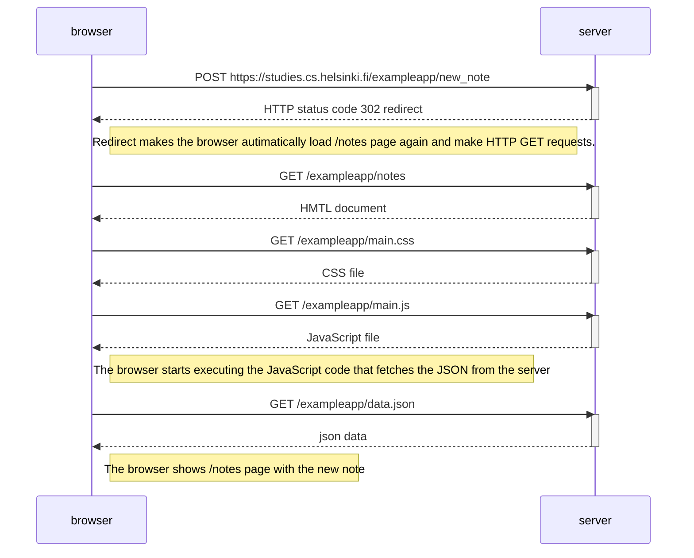

```mermaid
sequenceDiagram
    participant browser
    participant server
    
    browser->>server: POST https://studies.cs.helsinki.fi/exampleapp/new_note
    activate server
    server-->>browser: HTTP status code 302 redirect
    deactivate server

    Note right of browser: Redirect makes the browser autimatically load /notes page again and make HTTP GET requests.

    browser->>server: GET /exampleapp/notes
    activate server
    server-->>browser: HMTL document
    deactivate server

    browser->>server: GET /exampleapp/main.css
    activate server
    server-->>browser: CSS file
    deactivate server

    browser->>server: GET /exampleapp/main.js
    activate server
    server-->>browser: JavaScript file
    deactivate server

    Note right of browser: The browser starts executing the JavaScript code that fetches the JSON from the server

    browser->>server: GET /exampleapp/data.json
    activate server
    server-->>browser: json data
    deactivate server

    Note right of browser: The browser shows /notes page with the new note

    
```
