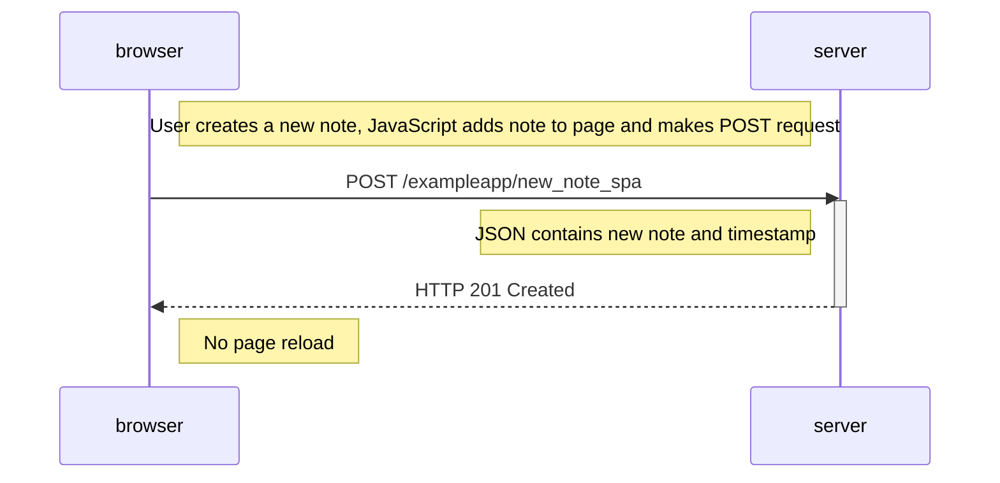

```mermaid
sequenceDiagram
    participant browser
    participant server

    Note right of browser: User creates a new note, JavaScript adds note to page and makes POST request

    browser->>server: POST /exampleapp/new_note_spa
    activate server
    Note left of server: JSON contains new note and timestamp
    server-->>browser: HTTP 201 Created
    deactivate server

    Note right of browser: No page reload
```
